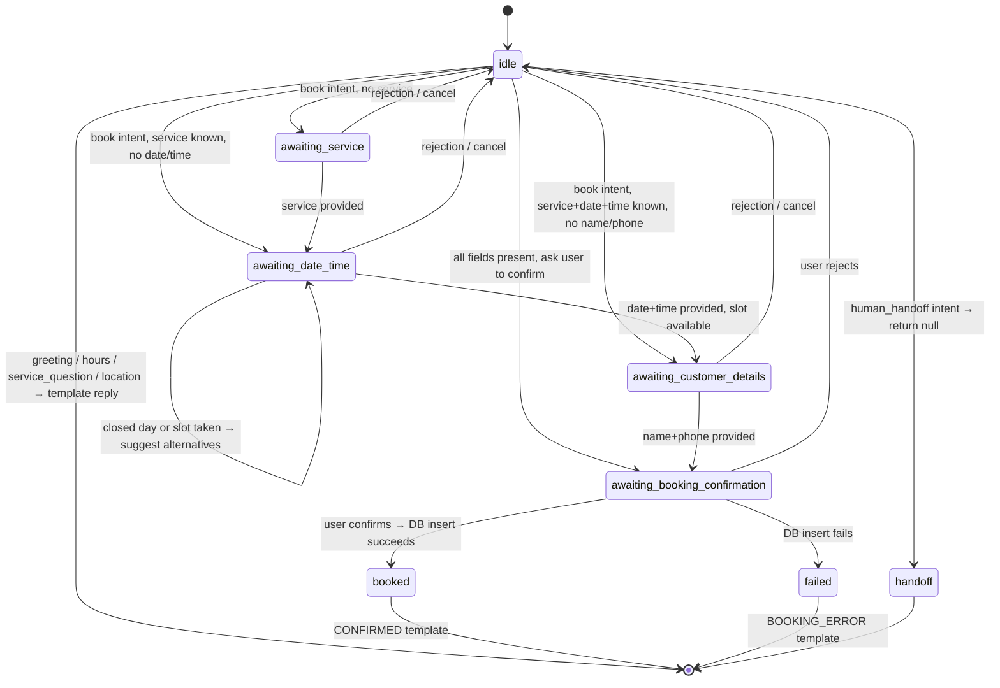
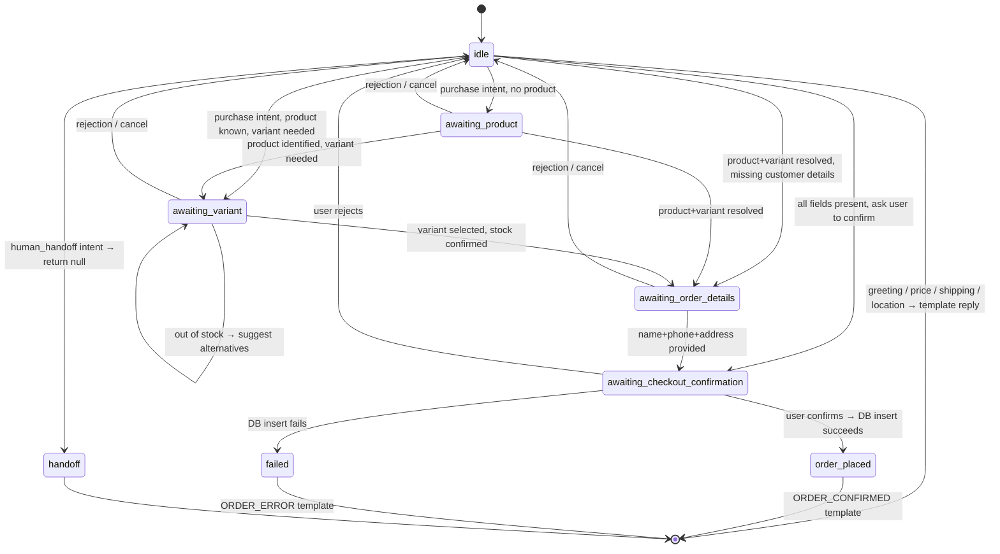

# Automation V2 — Conversation State Machines

> Audit date: 2026-04-27
> Status: COMPLETE — Phase 0

---

## Common Pipeline (Both Workspace Types)

Every incoming message follows this exact sequence:

```
1. Load workspace settings (ai_settings)
2. Load integration info (instagram_integrations)
3. Load conversation state (conversation_states)
4. Build TIME_CONTEXT (server time + workspace timezone)
5. Detect language
6. Normalize message

7. IF state.stage !== 'idle':
     → Process state-driven step (collect missing field, handle confirmation)
     → Skip classifier
8. ELSE:
     → Classify intent (LLM + fallback)
     → Load source-of-truth data
     → Determine next state

9. Validate action preconditions
10. Write to DB if all fields present
11. Select deterministic template reply
12. Optionally translate/polish into target language
13. Validate final reply (length, forbidden words, no false confirmation)
14. Log outcome
15. Return reply
```

---

## Appointments State Machine



### State Data Schema (Appointments)

```typescript
interface AppointmentStateData {
    stage: 'idle' | 'awaiting_service' | 'awaiting_date_time' |
           'awaiting_customer_details' | 'awaiting_booking_confirmation' |
           'failed' | 'handoff';
    pendingAction: 'create_appointment';
    appointment: {
        workspaceId: string;
        serviceId: string;
        serviceName: string;
        servicePrice: number;
        serviceDuration: number;
        date: string;          // YYYY-MM-DD
        startTime: string;     // HH:mm
        endTime: string;       // HH:mm
        timezone: string;
    };
    customer: {
        name: string | null;
        phone: string | null;
        instagramHandle: string | null;
    };
    missingFields: string[];   // ['customerName', 'customerPhone']
}
```

### Appointments — State Processing Rules

| Current Stage | User Says | Action | Next Stage |
|---|---|---|---|
| `idle` | greeting | Template: GREETING | `idle` |
| `idle` | "I want a haircut" | Resolve service → ask date/time | `awaiting_date_time` |
| `idle` | "I want to book" (no service) | Template: ASK_SERVICE | `awaiting_service` |
| `awaiting_service` | "Haircut" | Resolve service → ask date/time | `awaiting_date_time` |
| `awaiting_date_time` | "Tomorrow at 11am" | Check availability → ask name/phone | `awaiting_customer_details` |
| `awaiting_date_time` | "Sunday" (closed) | Template: CLOSED_DAY | `awaiting_date_time` |
| `awaiting_customer_details` | "Ali, 78820707" | Extract name+phone → ask confirm | `awaiting_booking_confirmation` |
| `awaiting_customer_details` | "ok" / "yes" | Template: NEED_NAME_PHONE (repeat) | `awaiting_customer_details` |
| `awaiting_booking_confirmation` | "yes" / "eh" | Insert appointment → CONFIRMED | `idle` (cleared) |
| `awaiting_booking_confirmation` | "no" / "la" | Template: REJECTION_ACK | `idle` (cleared) |
| any | "manager" / handoff word | return null | `handoff` |
| any | "cancel" / "no" during flow | Template: REJECTION_ACK | `idle` (cleared) |

---

## E-Commerce State Machine



### State Data Schema (E-Commerce)

```typescript
interface EcommerceStateData {
    stage: 'idle' | 'awaiting_product' | 'awaiting_variant' |
           'awaiting_order_details' | 'awaiting_checkout_confirmation' |
           'failed' | 'handoff';
    pendingAction: 'create_order';
    order: {
        workspaceId: string;
        productId: string;
        productName: string;
        variantId: string | null;
        variantLabel: string | null;
        quantity: number;
        unitPrice: number;
    };
    customer: {
        name: string | null;
        phone: string | null;
        address: string | null;
        instagramHandle: string | null;
    };
    missingFields: string[];   // ['customerName', 'customerPhone', 'deliveryAddress']
}
```

### E-Commerce — State Processing Rules

| Current Stage | User Says | Action | Next Stage |
|---|---|---|---|
| `idle` | greeting | Template: GREETING | `idle` |
| `idle` | "Do you have the hoodie?" | Search inventory → reply availability | `idle` or `awaiting_variant` |
| `idle` | "I want the hoodie medium black" | Resolve product+variant → check stock → ask details | `awaiting_order_details` |
| `idle` | "I want to order" (no product) | Template: ASK_PRODUCT | `awaiting_product` |
| `awaiting_product` | "The hoodie" | Resolve product → check variants | `awaiting_variant` or `awaiting_order_details` |
| `awaiting_variant` | "Medium black" | Resolve variant → check stock | `awaiting_order_details` |
| `awaiting_variant` | "Medium pink" (out of stock) | Template: PRODUCT_UNAVAILABLE + alternatives | `awaiting_variant` |
| `awaiting_order_details` | "Ali, 78820707, Hamra" | Extract all → ask confirm | `awaiting_checkout_confirmation` |
| `awaiting_order_details` | "ok" / "yes" | Template: NEED_ORDER_DETAILS (repeat) | `awaiting_order_details` |
| `awaiting_checkout_confirmation` | "yes" | Insert order → ORDER_CONFIRMED | `idle` (cleared) |
| `awaiting_checkout_confirmation` | "no" | Template: REJECTION_ACK | `idle` (cleared) |
| any | "manager" / handoff word | return null | `handoff` |

---

## Key Architecture Rule: State Before Classifier

The state machine takes priority over the intent classifier:

```
IF state.stage === 'awaiting_customer_details':
    → Try to extract name/phone from message
    → If found: advance state
    → If not found: repeat template
    → Do NOT re-classify intent (would lose context)
```

This prevents the current V1 bug where "Ali, 78820707" gets classified as `greeting` and the booking flow is lost.
